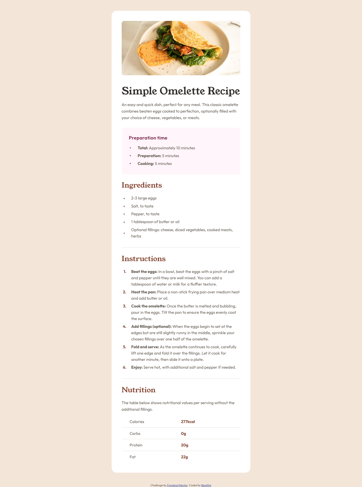
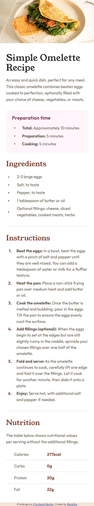

# Frontend Mentor - Recipe page solution

This is a solution to the [Recipe page challenge on Frontend Mentor](https://www.frontendmentor.io/challenges/recipe-page-KiTsR8QQKm). Frontend Mentor challenges help you improve your coding skills by building realistic projects.

## Table of contents

- [Overview](#overview)
  - [The challenge](#️the-challenge)
  - [Screenshot](#screenshot)
    - [Desktop](#desktop)
    - [Mobile](#mobile)
  - [Links](#links)
- [My process](#my-process)
  - [Built with](#️built-with)
  - [Features](#features)
  - [What I learned](#what-i-learned)
  - [Accessibility](#accessibility)
  - [Continued development](#continued-development)
  - [Useful resources](#useful-resources)
- [Author](#author)
- [Acknowledgments](#acknowledgments)

## 📋Overview

The challenge is to build out the recipe page and get it looking as close to the design as possible using semantic HTML, modern CSS, and good accessibility practices.

### 🎖️The challenge

Users should be able to:

- View the recipe page on different screen sizes without losing readability or layout structure
- Read the content clearly with proper visual hierarchy
- Navigate the page using assistive technologies thanks to semantic HTML and accessible markup
- View images and content that adapt correctly to different devices

### 📸Screenshot

#### Desktop

#### Mobile

### 🔗Links

- Solution URL: [https://www.frontendmentor.io/solutions/accessible-and-responsive-recipe-page-f8QLKx_4q2](https://www.frontendmentor.io/solutions/accessible-and-responsive-recipe-page-f8QLKx_4q2)
- Live Site URL: [https://berefire.github.io/recipe-page/](https://berefire.github.io/recipe-page/)

## My process

### 🛠️Built with

- Semantic HTML5
- CSS custom properties
- Flexbox
- CSS Grid
- Mobile-first workflow
- BEM methodology
- Accessibility-first approach
- Responsive design with `clamp()`

### ✨Features

- Responsive and accesible recipe page
- Semantic HTML and clean CSS architecture
- Mobile-first layout with modern CSS features

### 📚What I learned

During this project I reinforced:

- How to structure a page using semantic HTML elements such as `main`, `article`, `section`, and `header`
- Applying the BEM methodology to organize CSS in a clear and maintainable way
- Building responsive layouts using a mobile-first approach Flexbox and Grid
- Using modern CSS features like `clamp()` to handle responsive typography and spacing
- Managing layout consistency with CSS custom properties
- Improving accessibility through proper heading hierarchy, readable contrast, and accessible table structures
- Writing cleaner CSS by avoiding unnecessary wrappers and duplicated rules

### ♿Accessibility

This project follows basic WCAG 2.1 AA accessibility guidelines, using semantic HTML, proper heading hierarchy, and accessible table structures to improve screen reader support.

### 🚀Continued development

In future projects, I want to:

- Continue improving accessibility by testing with screen readers
- Refine semantic HTML structures for better usability
- Explore more advanced responsive layout techniques
- Further optimize and simplify CSS organization

### 📖Useful resources

- [MDN Web Docs](https://developer.mozilla.org/) - A great encyclopedia to consult CSS properties.
- [CSS Tricks Flexbox Guide](https://css-tricks.com/snippets/css/a-guide-to-flexbox/) - This is an amazing article which helped me finally understand Flexbox. I'd recommend it to anyone still learning this concept.
- [CSS Tricks Grid Guide](https://css-tricks.com/css-grid-layout-guide/) - This guide helps you to understand the Grid Properties.
- [Google Fonts](https://fonts.google.com/) - In this site you can obtain any font that you want to design your web site.

## 👤Author

- Frontend Mentor - [@berefire](https://www.frontendmentor.io/profile/berefire)
- GitHub - [@berefire](https://github.com/berefire)

## 🙏Acknowledgments

Thanks to Frontend Mentor for providing high-quality challenges that help developers grow through practice.
